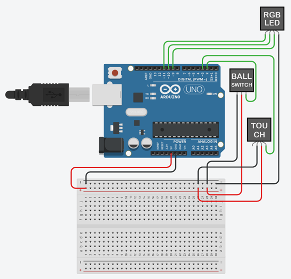
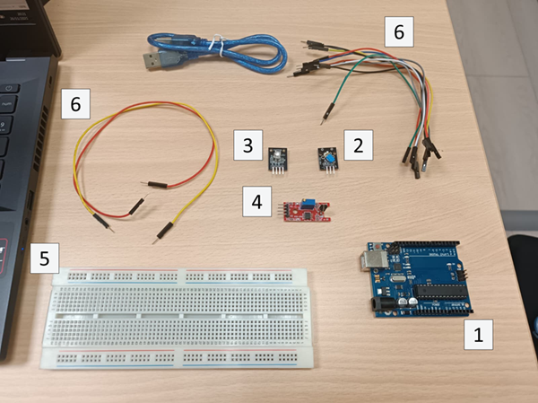
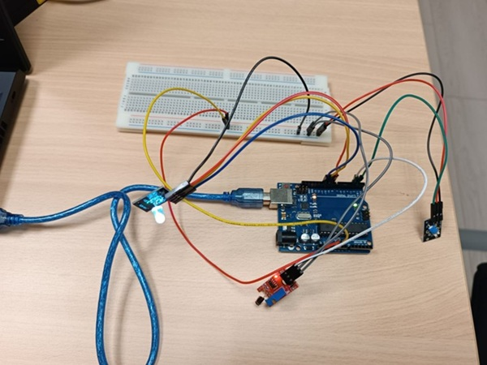

# Flip Timer with Ball Switch and Touch Sensor

## Overview
This project implements a hands-free countdown timer controlled by physical interaction. By flipping the device and holding it steady, the timer automatically starts without requiring buttons. A touch sensor enables additional controls such as pausing, resuming, resetting, and changing timer modes.

## Features
- Flip-based automatic timer activation  
- Three selectable timer durations: 10s, 20s, 30s
- Touch-based interaction (pause, resume, reset, mode selection)
- Real-time visual feedback using RGB LED  

## Technologies
- Arduino (C++)
- Ball switch (orientation detection)
- Touch sensor (user input)
- RGB LED (PWM control)

## How It Works

### Orientation Detection
A ball switch is used to detect when the device is flipped. To avoid false triggers, the system waits until the signal remains stable for 5 seconds before starting the timer.

### Input Handling
The touch sensor supports multiple interactions:  
Short press:
- Idle → cycle timer mode
- Running → pause timer
- Paused → resume timer

Long press (≥5 seconds): Reset the system

### Timer Logic
The timer uses a non-blocking approach based on millis(), allowing the system to track time while continuously handling sensor inputs.

### System States
The application operates in three main states:
- Idle
- Running
- Paused

Transitions between states are controlled by sensor inputs.

### Visual Feedback
The RGB LED provides continuous feedback:  

Mode selection:
- Green → 10 seconds
- Blue → 20 seconds
- Red → 30 seconds

Timer progress:
- 0–50% → steady color
- 50–90% → pulsing effect
- 90–100% → blinking warning

Completion: Rainbow animation followed by white flashes

### Design Considerations
- Debouncing: Ball switch signal stabilizes over 5 seconds to prevent false triggers
- Non-blocking timers: Uses millis() instead of delay() to handle concurrent inputs

## How to Use

### Starting the Timer
1. Power on the device
2. Flip it to the desired position
3. Hold it stable for ~5 seconds
4. The LED will indicate the timer has started

### Changing Timer Mode
Tap the touch sensor to cycle through:
- Green → 10s
- Blue → 20s
- Red → 30s

### Pause / Resume
- Tap once while running → pause
- Tap again → resume
### Reset
Hold the touch sensor for ~5 seconds

## Hardware Required
- Arduino Uno
- Ball switch 
- Touch sensor
- RGB LED
- Resistors
- Breadboard and jumper wires

## Images
  
  

